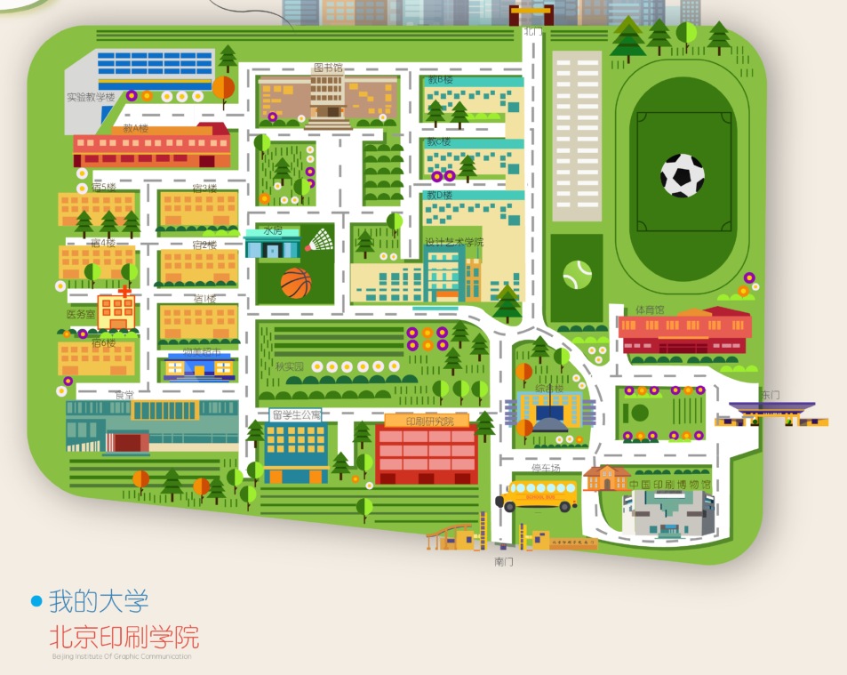

# 北印校园导航

python 语言程序设计-期末大作业

## 一、整体设计目标

针对新生对校园了解的不足，帮助新生对校园中的各建筑有更加多方面的了解。同时可以对于校园工作人员优化校园工具的搬运选择最优的运输路径，提高运输的效率。
通过对 dijkstra 算法进行编写，实现从一个顶点到其余各顶点的最短路径算法，解决的有向图中最短路径问题。主要特点是以起始点为中心向外层层扩展，直到扩展到终点为止，是一种广度优先的搜索方法。

## 二、代码总体框架 

两点移动
两点之间距离判断
Dijkstra 算法
初始化地图
初始化弹出框
输入起始地与目的地开始运行

## 三、第三方库介绍 

### turtle 库：

Turtle 库是 Python 语言中绘制图像的函数库，在一个横轴为 x、纵轴为 y 的坐标系原点，(0,0)位置开始，它根据一组函数指令的控制，在这个平面坐标系中移动，从而在它路径上绘制了图形。
绘图窗体方法：turtle.setup(width,height,startx,starty)
turtle 的移动方法：turtle.goto(x,y)

### collections 工具库：

collection 是一个容器的集合。本次项目使用defaultdict，解决使用 dict 时 key 为空的情况。使用 defaultdict 之后，如果key 不存在，容器会自动返回我们预先设置的默认值。需要注意的是 defaultdict传入的默认值可以是一个类型也可以是一个方法。

## 四、地图

